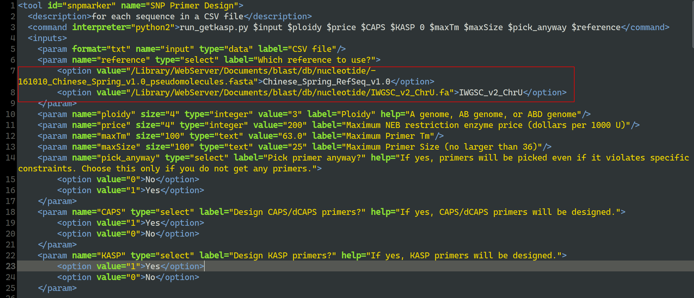
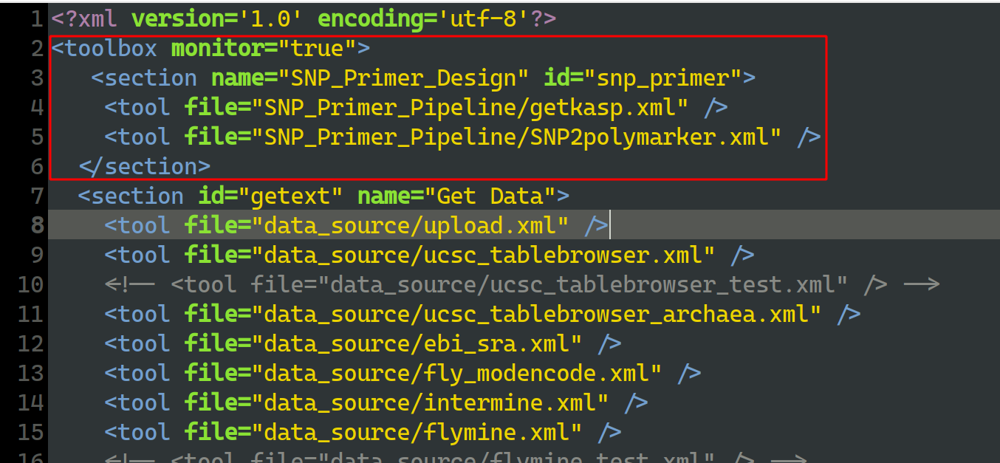
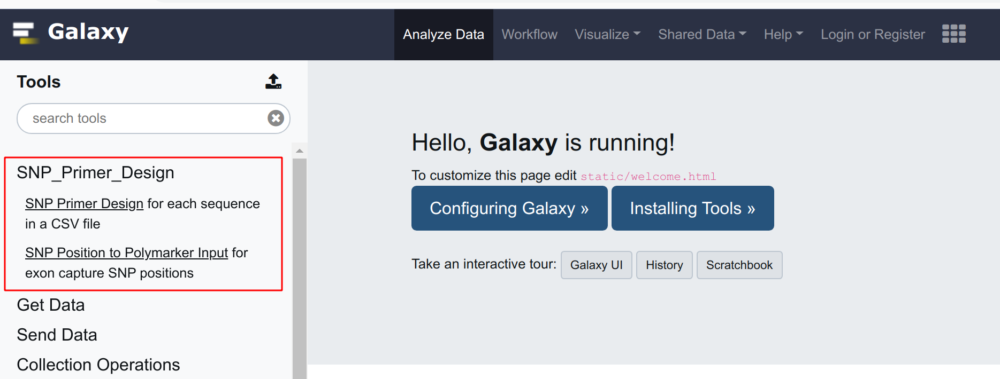

# SNP Primer Design Pipeline
These scripts make a simple pipeline to design **KASP** (Kompetitive Allele Specific PCR) and **CAPS/dCAPS** primers for SNP genotyping. 

Polymarker (http://polymarker.tgac.ac.uk/) is a great software to design KASP primers, but sometimes I have some specific requirements that Polymarker cannot meet, and it is difficult for me to modify its scripts because I do not know Ruby. That is why I wrote these simple scripts to just meet my requirements.

# Main Changes

- 10/23/2019: Change all script to use python2 and make it easy for users to implement on there Galaxy server.
- 09/02/2019: add "PRIMER\_PICK\_ANYWAY" option for the situation when no primers were obtained.
- 09/01/2019: add a primer3 global setting file for easy change some parameters.
- 09/01/2019: add maximum primer length parameter for low GC content region
- 08/02/2019: add a maximum hits filter: if more than 6 hits, do not design for this SNP, because some SNPs have too many hits.
- 05/26/2019: updated SNP position to polymarker input to fit BLAST+ 2.9.0+. So you need to update your BLAST+ from 2.6.0 to 2.9.0, because the blastdbcmd output format changed in 2.9.0.
- 03/30/2018 Add a new script getCAPS-with-user-input to use user provided multipe sequences to design CAPS/dCAPS primers and the variations can also be an indel now.
- 12/20/2017 Renamed the repository from "getKASP_pipeline" to "SNP_Primer_Pipeline"
- 08/29/2017 Included xml files for used in galaxy
- 08/29/2017 Added a script for extracting sequences in the reference file.
- 06/05/2017 Added step to design both CAPS and dCAPS primers using the restriction enzyme list from NEB.
- 05/14/2017 Added steps to check restriction enzymes for CAPS marker design.
- Added ploidy parameter for wheat species in different ploidy.

# Pseudo code
1. Read the polymarker input and get:
	- snp position
	- sequences and make them a fasta file for blast later
2. Blast using the fasta file and output blast results
3. Process blast output file to extract flanking sequences (250 bp each side)
4. Multiple sequence alignment of the homeologs
5. Use the msa file to design primers using primer3

# Dependencies

SNP_Primer_Pipeline needs following 3 software to find differences among homeologs and design primer.
1. **Muscle**: Multiple sequence alignment program (http://www.drive5.com/muscle/)
2. **Primer3**: program for designing PCR primers (http://primer3.sourceforge.net/)
3. **blast+** package from NCBI (https://blast.ncbi.nlm.nih.gov/Blast.cgi)

"**muscle**" and "**primer3_core**" are included in the package, so "**blast+**" is the only software you need to install in your system.

# How it works
1. Find all the different sites that can differ all other sequences from the user provided alignment file;
2. Use these sites and the SNP site as SEQUENCE_FORCE_RIGHT_END in primer3 to design all possible left and right primers in the target sequence.

# Usage

I divided the pipeline into 8 steps:
- Script "parse_polymarker_input.py": parse the polymarker input and prepare a fasta file for blast
- Blast using system command "blastn"
- Script "getflanking.py": Parse the blast output file and output the homelog contigs and flanking ranges
- Split the range file for each marker with system command "awk"
- Get flanking sequences for each file with command "blastdbcmd"
- Get KASP primers using script "getkasp3.py"
- Get CAPS primers using script "getCAPS.py"
- Blast the primers against the wheat pseudomolecule v1.0


You can run this step by step or run the whole pipeline with script "run_getkasp.py". I suggest run the 6 steps in the script "run_getkasp.py" stey by step to get familiar how it works first.

Example: `run_getkasp.py for_polymarker.csv 3 200 1 1 0 63 25 /home/junli/blastdb/iwgsc_refseqv1.0.fasta`

Inputs are: polymarker_input, ploidy, enzyme maximum price (per 1000 U), whether to design CAPS (1 for yes and 0 for NO), whether to design KASP (1 for yes and 0 for NO), whether to blast primers (1 for yes and 0 for NO), maximum Tm (63 C for example), maximum primer size (25 bp for example), whether to pick primer anyway even if it violates specific constrains, reference file path.


The "bin" folder has all the scripts for each step and software primer3 and muscle in case your system does not have them.

# How to implement it to your own Galaxy server

**Before doing this, please make your blast database ready.** For wheat, please download the RefSeqv1.0 for example, and extract the fasta file, then run the command below to make it blastable:

`makeblastdb -in 161010_Chinese_Spring_v1.0_pseudomolecules.fasta -dbtype nucl -parse_seqids`

I suggest put both the "**SNP Position to polymarker input**" and the "**SNP Design Pipeline**" tools in the Galaxy tool menu.

1. Go to the Galaxy root folder and go to the "tools" folder: `cd tools`

1. Clone the SNP Primer Design Pipeline to the "tools" folder: `git clone https://github.com/pinbo/SNP_Primer_Pipeline.git`

1. Go to the "SNP\_Primer\_Pipeline" folder: `cd SNP_Primer_Pipeline`

1. Make a copy of the file "*SNP2polymarker.xml.example*" and rename it "*SNP2polymarker.xml*". Or `cp SNP2polymarker.xml.example SNP2polymarker.xml`. Do the same thing for "*getkasp.xml.example*": `cp getkasp.xml.example getkasp.xml`

1. Edit the configuration files "SNP2polymarker.xml" and "getkasp.xml". At least change the reference file location (Red rectangle in the screenshot below): "value=" is the location.


1. Go back to the Galaxy root folder and go to the "config" folder and add the tool xml location in the file "*tool\_conf.xml*". If the file is not there, just make a copy of "*tool\_conf.xml.sample*" and rename it "*tool\_conf.xml*". Then add the tool xml location there:
```{xml}
<section name="SNP_Primer_Design" id="snp_primer">
    <tool file="SNP_Primer_Pipeline/getkasp.xml" />
    <tool file="SNP_Primer_Pipeline/SNP2polymarker.xml" />
</section>
```


Now the tools should be there. 


More details about adding your own tools to Galaxy can be found here: https://galaxyproject.org/admin/tools/add-tool-tutorial/

# Acknowledgements
I borrowed ideas from the polymarker scripts (https://github.com/TGAC/bioruby-polyploid-tools), a great tool for Genome Specific KASPar design in polyploid species. Thanks to the author of Polymarker.

I also borrowed some codes from biopython (https://github.com/biopython/biopython/blob/master/Bio/Emboss/Primer3.py). Thanks to them too.

Thanks to the open source software **Primer3** (http://primer3.sourceforge.net/), **Muscle** (http://www.drive5.com/muscle/),  blast+ package from NCBI (https://blast.ncbi.nlm.nih.gov/Blast.cgi), and **SNP2CAPS** (http://pgrc.ipk-gatersleben.de/snp2caps/).
