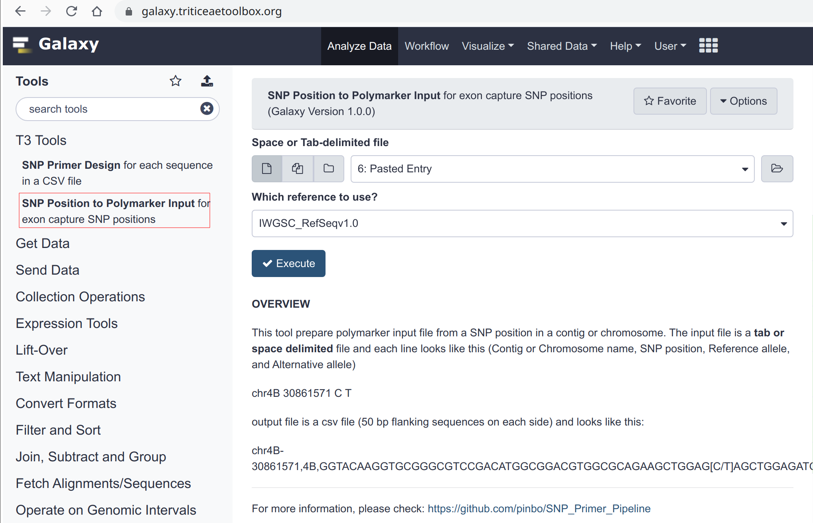
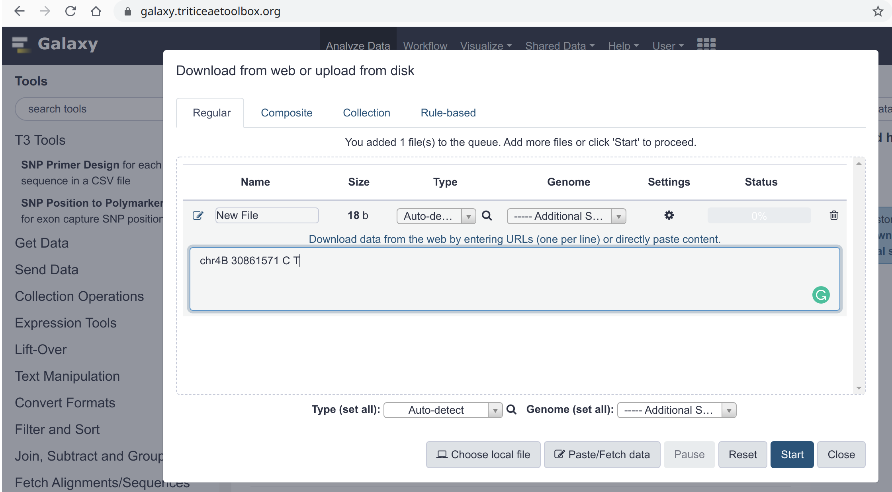
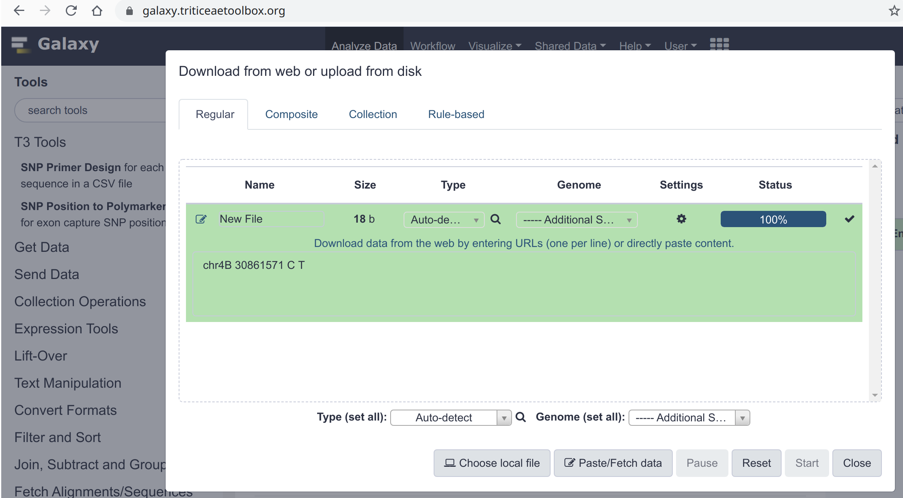
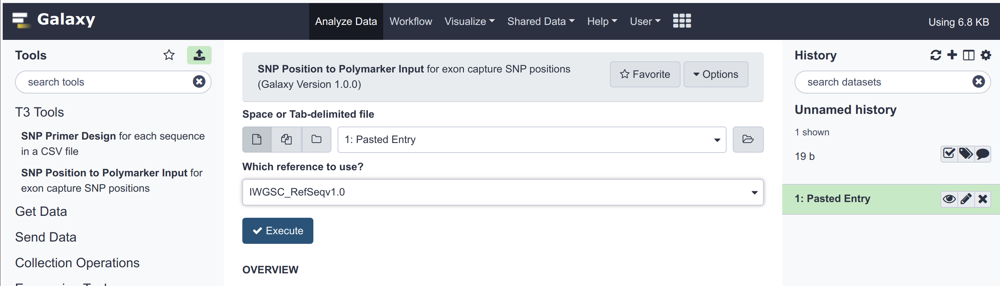
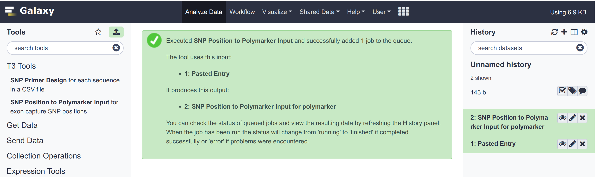
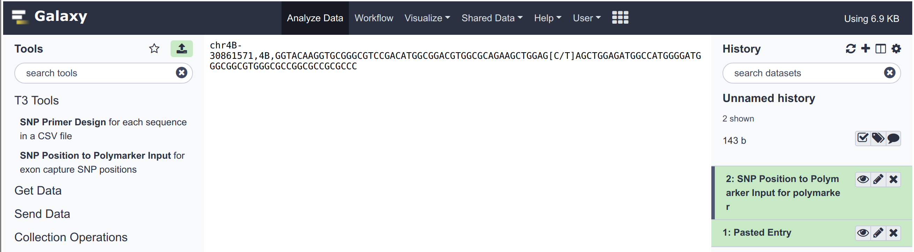
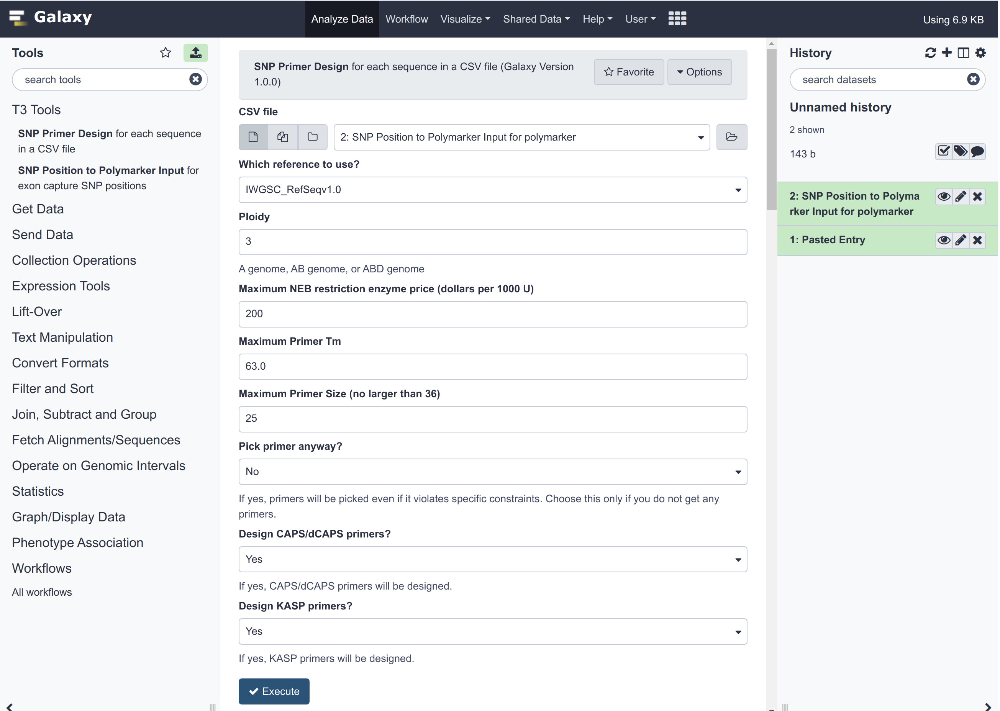
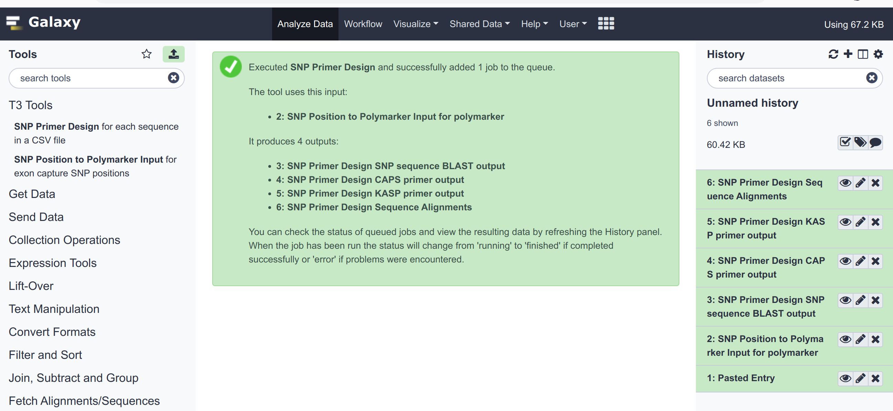
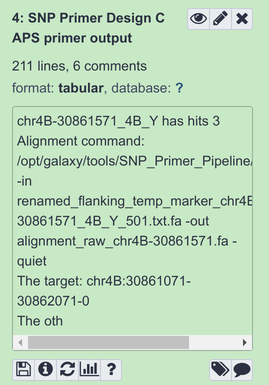

# SNP Primer Design Pipeline Tutorial

#### Junli Zhang        2019-11-10

The Galaxy tool "SNP Primer Design" pipeline can design both KASP and CAPS/dCAPS primers for SNPs. It uses the same input as [PolyMarker](http://www.polymarker.info/about). For example:

`SNP-ID,4B,ACAAGGTGCGGGCGTCCGACATGGCGGACGTGGCGCAGAAGCTGGAG[C/T]AGCTGGAGATGGCCATGGGGATGGGCGGCGTGGGCGCCGGCGCCGCGCCC`

Each line is one SNP, including SNP-ID, chromosome, and flanking sequences with SNP alleles, separated by commas, **NO space allowed**.

If you only have the location of the SNPs, you can use the other tool "**SNP Position to Polymarker Input**" to convert the SNP information to the polymarker input.

You can click "**SNP Position to Polymarker Input**" on the left side of the tool panel. The **OVERVIEW** below the input parameters explains how to use this tool.

## Upload the SNP information

Here we will use the example input: `chr4B 30861571 C T`

We can paste the SNP information or upload a file containing the information. Here I used "Paste/Fetch data". Then press "Start" to upload the data.

Close the window when uploading is complete.

## Convert SNP Position to Polymarker input

You can click "**SNP Position to Polymarker Input**" on the left side of the tool panel. You can see on the right the first entry in your History. You can click the eye icon to view the content of this entry.

The input now is selected (entry 1) by default, because there is only one potential input. If you have multiple entries in your history, then the most recent file that meets the format requirement will be selected, but you can click the dropdown and select the file you need. Then press "**Execute**".

When this job is finished, the history entry will become green. Now let us click the eye icon of entry 2 to view the result.

## Design KASP/CAPS/dCAPS primers

We see the polymarker-style input has been created. Now entry 2 can be the input for the "SNP Primer Design" tool. We can click the tool on the left to design primers for this SNP.

We see that 9 input parameters need to be set. Here is the explanation of each parameter.

1. **CSV file**: polymarker-sytle input. Here is entry 2.

2. **Which reference to use**: the sequence reference file. Now only IWGSC_RefSeqv1.0 is available because most of the SNPs are called based on this version. Later we may add more references.

3. **Ploidy**: 1 for only diploid wheat (A genome), 2 for tetraploid wheat (AB genomes), and 3 for hexaploid wheat (ABD genomes). If you just need to design primers for a tetraploid wheat, such as Kronos, then the D genome does not need to be considered when designing genomic specific primers.

4. **Maximum NEB restriction enzyme price (dollars per 1000 U)**: a lot of SNP sites can be digested with multiple restriction enzymes, and this price filter is to just choose cheap enzymes.

5. **Maximum Primer Tm**: The maximum Tm values allowed when designing primers. For the high GC content region, you can increase this value.

6. **Maximum Primer Size (no larger than 36)**: for low GC content region, you may increase this value.

7. **Pick primer anyway?**: If yes, primers will be picked even if it violates specific constraints. Choose this only if you do not get any primers. Most time, we won't use it.

8. **Design CAPS/dCAPS primers?**: whether to design CAPS/dCAPS markers. If you only need KASP primers, select "NO".

9. **Design KASP primers?**: whether to design KASP primers. If you only need CAPS/dCAPS primers, select "NO".

If you select NO for both the KASP and CAPS/dCAPS primers, it will only extract the SNP flanking sequence (500 bp on the left and 500 bp on the right, the SNP will be at 501) and its homeologs in the genome.

Then press "**Execute**" to run the tool. It takes less than a minute for each SNPs.

## Output explanation

When it is done, you will have 4 output files.

1. **The blast output for all SNPs.** The tool selects and extracts homeolog sequences based on the blast result. If the flanking sequence of an SNP has more than 5 hits, it will possibly in the repetitive region and no primers will be designed for it.

2. **CAPS/dCAPS primers**: All possible CAPS/dCAPS primers. It will be a blank file if you select "NO" for CAPS primers.

3. **KASP primer design**: All possible KASP primers. It will be a blank file if you select "NO" for KASP primers.

4. **Alignments of homeologs of each SNP**: You can use this file to check the final primers and see all the variations among the homeologs.

The first 3 files are tab-delimited, and you can download them and drag them into excel to view and edit.

To download the outputs, click on one entry and click the "Save/Download" button on the bottom:

### BLAT output

The names of the columns (q. = query, s. = subject):

query id, subject id, % identity, alignment length, mismatches, gap opens, q. start, q. end, s. start, s. end, evalue, bit score, q. sequence, s. sequence, q. length, and s. length

### CAPS/dCAPS primers

Remember the **SNP site is always 501**. There are many parameters for each primer, but firstly the primer needs to be specific enough, and then good on other aspects (such as low hairpin). Most of the time, you do not need to worry about other parameters, although I list them all in the output.

The header of the output:

1. **index**: the primer pair names. **Please sort this column first when imported to Excel.** Example chr4B-30861571-dCAPS-Bsp1286I,126-gdgchc-399-502-0: 
   
   - "chr4B-30861571" is the SNP name
   
   - "dCAPS": it is a dCAPS marker. 
   
   - "Bsp1286I,126-gdgchc": the enzyme name, Bsp1286I, its price,\$126/1000U, and its recognization sequence, gdgchc.
   
   - 399: the position of the 3' end of the forward primer on the template. This is a homeolog-specific site.
   
   - 502: the change site - 1, so the change site is 503. For dCAPS primer, one bp near the SNP is changed to create a recognization site for a specific enzyme.
   
   - 0: just the first select from the Primer3 output. You can ignore it.

2. **product_size**: The PCR product size.

3. **type**: LEFT is the forward primer, and RIGHT is the reverse primer.

4. **start**: The start position (5' end) of the primer. 

5. **end**: the end position (3' end) of the primer.

6. **diff_number**: the number of specific nt on the primer

7. **3'differall**: whether the 3' end of this primer can differ all other homeologs

8. **length**: primer length in bp

9. **Tm**: primer Tm

10. **GCcontent**: primer GC content

11. **any**: the tendency of a primer to bind to itself. The smaller, the better.

12. **3'**: the ability of primers to use itself as a target and amplify a short piece (forming a primer-dimer). The smaller, the better.

13. **end_stability**: The maximum stability for the last five 3' bases of a left or right primer. Bigger numbers mean more stable 3' ends.

14. **hairpin**: the melting temperature of the most stable hairpin structure of the primer. The smaller, the better.

15. **primer_seq**: primer sequence

16. **ReverseComplement**: the reverse complement of the primer sequence, just for easy checking in the template.

17. **penalty**: primer pair penalty. The smaller, the better.

18. **compl_any**: Penalty weight for the binding value of the primer pair. The smaller, the better.

19. **compl_end**: the ability to bind the 3'-END of the left primer to the right primer. The smaller, the better.

20. **PrimerID**: a unique ID for this primer.

21. **matched_chromosomes**: just ignore it, because I took out the blast option for validating primers. You can blast the genome with only the selected primers.

At the end of the file:

**Sites that can differ all**: all specific sites in the target template. You can use this information to design specific primers by yourself if no primers returned.

**CAPS cut information**: all the potential enzymes that can be used for CAPS/dCAPS primers. If the change position is "none", then it can be used for CAPS.

### KASP primers

You can sort this output by product size first because usually smaller product size is better for KASP.

The column names have the same meanings as in the CAPS output.

## PS

For more details about this tool, please check its GitHub page (https://github.com/pinbo/SNP_Primer_Pipeline). 

To cite this tool, please write something like this in your paper:

> Primers were designed using the SNP Primer Design Pipeline (https://github.com/pinbo/SNP_Primer_Pipeline) in the Triticeae Toolbox Galaxy (https://galaxy.triticeaetoolbox.org/).

I strongly suggest registering on the Triticeae Toolbox Galaxy, so you can create new histories and access them anywhere.

To learn more about Galaxy, please check here: https://galaxyproject.github.io/training-material/topics/introduction/tutorials/galaxy-intro-101/tutorial.html
